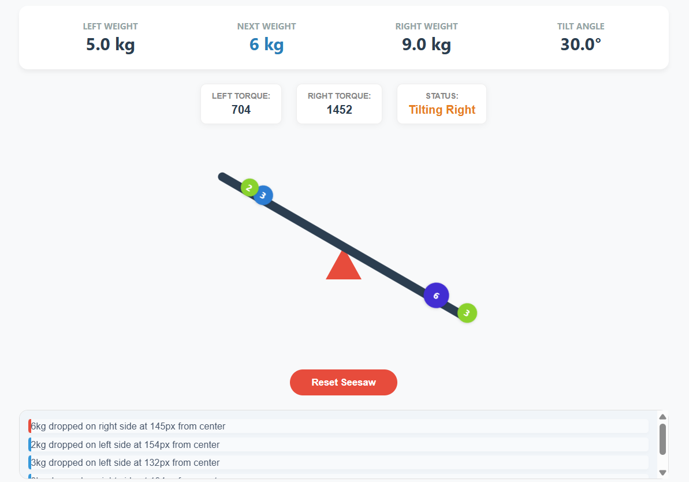

# Seesaw  Simulation 

A high-precision, physics-based interactive seesaw simulation built with **pure vanilla JavaScript**. This project focuses on accurate torque mechanics, stable coordinate mapping, and a professional engineering dashboard.

## 🎮 [[Live Demo Linki](https://ilaydakarkus2.github.io/seesaw/)]

## 📸 Preview


*Interactive seesaw with real-time physics and visual feedback*

## ✨ Key Features

* **Precise Physics Engine:** Implements the $Torque = Weight \times Distance$ formula with real-time updates.
* **Live Torque Dashboard:** Displays real-time left/right torque values and balance status (Balanced vs. Tilting).
* **Coordinate Stability Fix:** Resolved the "tilted coordinate" issue by using a static reference frame (`simulation-area`) for object placement.
* **Activity Logger:** A persistent log area tracking interaction history with precise distance data.
* **State Management:** Centralized state handling to ensure consistency between logic, UI, and reset functionality.
* **Smooth UX:** 60fps animations using CSS transforms and `cubic-bezier` transitions for a natural physical feel.

## 🎯 Implementation Details

### 1. Physics & Torque Logic
The simulation calculates the rotational force for every object based on its mass and distance from the pivot point:
- **Formula:** $Torque = Weight \times Distance$
- **Angle Calculation:** The tilt angle is derived from the net torque difference: $\text{Angle} = \frac{\text{RightTorque} - \text{LeftTorque}}{10}$
- **Constraint:** The angle is strictly capped at $\pm30^{\circ}$ as per the case requirements.


### 2. Engineering Challenges & Solutions

**The "Tilted Plank" Coordinate Mapping (The 148px Problem)**
- **Challenge:** Clicking on a rotated element (`plank`) returns coordinates relative to its tilted state, causing objects to drop at incorrect horizontal distances.
- **Solution:** I implemented a **Static Reference Frame**. By listening for clicks on the non-rotating `simulation-area`, I captured the true horizontal distance from the pivot. This ensures that "200px from center" remains 200px regardless of the seesaw's tilt.

**UI Stability & Layout Shift**
- **Challenge:** Growing log entries were pushing the dashboard and seesaw out of view.
- **Solution:** Used a **Flexbox-based overflow strategy**. The simulation area is fixed, while the log area is allowed to grow and scroll internally using `flex-grow: 1` and `overflow-y: auto`.

## 🤖 AI Usage Disclosure

I utilized AI (Gemini) as a **Technical Consultant** and **Pair Programmer** during this project.

* **My Independent Work:** I designed the initial HTML/CSS structure, implemented the core state management, and established the fundamental physics loop.
* **AI Collaboration:**
    - Assisted in optimizing the CSS Flexbox layout to prevent layout shifts.
    - Collaborated on resolving the mathematical mapping of coordinates for the tilted plank.
    - Reviewed the `updatePhysics` logic to ensure torque calculations were robust and efficient.
* **What AI Did NOT Do:**
  - Did not generate the main codebase
  - Did not write the physics simulation logic
  - Did not create the UI structure or styling
  - Did not implement the state management system
  
I can clearly explain every part of the implementation and all design decisions made throughout the development process.

## 🛠️ Technologies Used

* **JavaScript (ES6+):** Physics engine, DOM manipulation, and event handling.
* **HTML5 & CSS3:** Responsive layout and GPU-accelerated animations.
* **Git:** Version control with atomic, descriptive commits.

## 🚀 Local Development

Since this project uses pure Vanilla JavaScript and no external dependencies, setting it up locally is very straightforward:

```bash
# Clone the repository
git clone [https://github.com/ilaydakarkus2/seesaw.git](https://github.com/ilaydakarkus2/seesaw.git)

# Navigate to project directory
cd seesaw

# Open in browser
# Simply open index.html in your preferred browser
# No build process or dependencies required
   ```

## 🎓 Learning Outcomes
This project demonstrates proficiency in several core engineering areas:

* **Pure JavaScript DOM Manipulation:** Handling dynamic elements without frameworks.

* **Applied Physics:** Implementing torque calculations and resolving coordinate challenges.

* **UX/UI Design:** Creating a stable, responsive layout with clear visual feedback.

* **Git Workflow:** Maintaining a clean and well-documented codebase.

## 📂 Project Structure
```text
seesaw-simulation/
├── assets/
│   └── seesaw.png      # Project screenshot
├── index.html          # Semantic HTML structure
├── style.css           # Modern CSS with BEM-like naming
├── app.js              # Core physics engine and state logic
└── README.md           # Documentation
```


## 👨‍💻 Author
İlayda Karkuş


